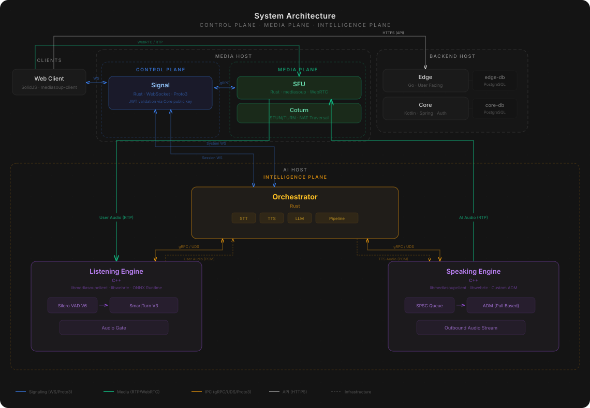

# SaasyByte — Real-Time AI Voice Platform

> An open-source, multi-provider, real-time AI voice platform where users have live audio conversations with an AI assistant over WebRTC. Built for sub-second response latency, from raw WebRTC primitives up.

---

<a>



</a>

---

## Status

Working end to end: real-time voice conversations with interruption handling, swappable providers, and usage-budgeted sessions. Built solo from raw primitives, and run in production at small scale. Expect rough edges, especially around audio edge cases, and load beyond a handful of concurrent sessions is untested.

I started this project before I knew LiveKit existed, and by the time I learned of it the platform was nearly done. Operating a bespoke WebRTC and audio stack has a long tail (SFU tuning, headless audio device modules, echo and interruption edge cases, codec quirks across devices), so for new work I've moved to LiveKit, and development here is opportunistic rather than scheduled. Issues and PRs are welcome.

## Overview

SaasyByte is a real-time AI voice platform built from scratch as a solo project. Users connect through a web browser and have natural, low-latency voice conversations with an AI assistant, including real-time interruption handling, turn detection, and streaming audio in both directions over WebRTC. Anysia is the platform's assistant persona; the persona is just a system prompt, so deployments can swap in their own.

The system spans **7 services and a web client** across **5 languages** (Rust, C++, Go, Kotlin, TypeScript), coordinated through a purpose-built signaling layer. The platform is composed of the `saasy-*` service repositories under the [saasybyte](https://github.com/saasybyte) organization. This repository is the front door: the architecture deep dive, the repository index, and the full-stack Docker Compose to run it all.

A core design principle is **provider independence**. The platform doesn't build its own LLM, STT, or TTS. Instead, it integrates external provider APIs through a multi-provider architecture where providers are swappable per modality at runtime. The current provider catalog includes OpenAI, Anthropic, xAI, Groq, Deepgram, Speechmatics, ElevenLabs, Cartesia, AWS, and GCP. The model catalog is managed by the API service and queried by the Orchestrator at runtime, meaning new providers and models can be added without touching the inference pipeline.

## Repositories

| Repo | Language | Role |
|------|----------|------|
| [saasy-signal](https://github.com/saasybyte/saasy-signal) | Rust | WebSocket signaling, session coordination, JWT validation, usage budget enforcement |
| [saasy-sfu](https://github.com/saasybyte/saasy-sfu) | Rust | WebRTC Selective Forwarding Unit built on mediasoup, media routing |
| [saasy-orchestrator](https://github.com/saasybyte/saasy-orchestrator) | Rust | AI inference coordination (STT, LLM, TTS), multi-provider pipeline |
| [saasy-media-engine](https://github.com/saasybyte/saasy-media-engine) | C++ | Listening Engine (inbound audio, VAD, turn detection) and Speaking Engine (outbound audio) |
| [saasy-edge](https://github.com/saasybyte/saasy-edge) | Go | User-facing API, AI provider/model registry |
| [saasy-core](https://github.com/saasybyte/saasy-core) | Kotlin/Spring | Authentication, JWT issuance, invite codes |
| [saasy-web](https://github.com/saasybyte/saasy-web) | TypeScript/SolidJS | Browser client, WebRTC media handling |
| [saasy-proto](https://github.com/saasybyte/saasy-proto) | Proto3 | Canonical protobuf schemas, shared across all services |
| [saasy-proto-rust](https://github.com/saasybyte/saasy-proto-rust) | Rust | Generated proto types + mediasoup conversions for the Rust services |
| [saasy-proto-ts](https://github.com/saasybyte/saasy-proto-ts) | TypeScript | Generated proto types for the web client (`@saasybyte/saasy-proto-ts` on npm) |

## Running the Full Stack

The `docker-compose.yml` in this repository builds and runs every service from source. You bring API keys for the providers you want to use.

```bash
mkdir saasybyte && cd saasybyte
for r in saasybyte saasy-proto saasy-proto-rust saasy-proto-ts saasy-signal saasy-sfu \
         saasy-orchestrator saasy-media-engine saasy-edge saasy-core saasy-web; do
  git clone --recursive https://github.com/saasybyte/$r.git
done
cd saasybyte
cp .env.example .env   # fill in provider API keys + secrets
docker compose up --build
```

Then run the web client (not containerized) in a second terminal:

```bash
cd ../saasy-web
bun install
bun dev   # http://localhost:5173
```

See `.env.example` for the required variables, including how to generate the JWT keypair. Each service repository's README covers running that service standalone for development.

### First Run

Two one-time steps once the stack is up:

1. **Seed the provider catalog** (populates the model dropdowns; trim `seed-edge.sql` to the providers you have keys for):

```bash
docker compose exec -T edge-db psql -U "$EDGE_DB_USER" -d saasy-edge-db < seed-edge.sql
```

2. **Create an invite code** (uses the `ADMIN_API_KEY` from your `.env`):

```bash
curl -s -X POST http://localhost:8082/api/v1/invite-codes/generate \
  -H "X-Admin-Key: $ADMIN_API_KEY" -H "Content-Type: application/json" \
  -d '{"count": 1}'
curl -s -X POST http://localhost:8082/api/v1/invite-codes/claim \
  -H "X-Admin-Key: $ADMIN_API_KEY"
```

Enter the claimed code at `http://localhost:5173`, pick your providers, and talk.

## Architecture

The real-time system is organized into three logical planes, each with a distinct responsibility:

| Plane | Responsibility | Services |
|-------|---------------|----------|
| **Control** | Session coordination, signaling | Signal |
| **Media** | Audio transport, NAT traversal | SFU, TURN server |
| **Intelligence** | AI inference, audio processing, voice pipeline | Orchestrator, Listening Engine, Speaking Engine |

The backend services (Edge, Core) and the web client sit outside the three planes. They integrate at session boundaries (authentication, model catalog queries) but are not part of the real-time system itself.

### Host Topology

For deployment, services group onto three host classes:

- **Media Host**: runs the signaling server and SFU together. Signaling needs sub-millisecond access to the SFU for media resource operations, making co-location the natural choice.
- **AI Host**: runs the Orchestrator and both media engines as three separate long-running processes. Each service handles multiple concurrent sessions internally, functioning as a distributed AI client that coordinates through the signaling layer.
- **Backend Host**: runs the user-facing API and auth services with their respective databases.

This gives deployment simplicity without sacrificing the architectural separation. Each service is independently deployable; co-location is a deployment decision, not an architectural one.

## How a Session Works

A session flows through all three planes:

1. **Authentication**: the client validates an invite code with the auth service and receives a signed JWT. The invite code isn't a one-shot token; it carries a time-windowed usage budget that is enforced throughout the session.
2. **Session Creation**: the client opens a WebSocket to the signaling server and requests a session, passing the JWT in the create session command. The signaling server validates the JWT using the auth service's public key, allocates media resources on the SFU via an internal RPC, and returns transport parameters to the client.
3. **AI Participation**: the signaling server publishes a session-created event on a system-level channel. The Orchestrator, which maintains a persistent connection to the signaling server, receives this event and autonomously joins the session, establishing its own signaling connection and instructing both media engines to set up their respective audio streams.
4. **Audio Flow**: user audio flows from the client to the SFU to the Listening Engine. The Listening Engine runs voice activity detection and turn detection locally, gating audio before forwarding it to the Orchestrator for transcription. The Orchestrator processes the transcript through the LLM, streams the response through TTS, and pipes the resulting audio to the Speaking Engine, which transmits it back through the SFU to the client.
5. **Usage Tracking**: during the session, the signaling server reports consumed seconds back to the auth service via gRPC. The auth service tracks the budget and returns remaining seconds; the signaling server enforces limits, issuing warnings and terminating sessions when the budget is exhausted. A cross-service feedback loop that gates active sessions, not just initial access.
6. **Interruption**: if the user speaks while the AI is responding, the Listening Engine detects speech onset immediately and signals the Orchestrator, which cancels the in-flight response and begins processing the new input.

The key design goal: the AI's "hearing" path (SFU to Listening Engine) is a direct media connection that bypasses the Orchestrator entirely, minimizing latency on the most time-sensitive path.

## System Design Decisions

The system is optimized end-to-end for sub-second response latency. Most architectural decisions below flow from that constraint: every layer is designed to minimize unnecessary hops, avoid redundant serialization, and keep the hottest paths as short as possible. This consistently meant choosing the more complex path (more services to coordinate, more IPC boundaries to manage, harder debugging) in exchange for eliminating unnecessary latency at every layer.

### Why Three Planes

Signaling, media transport, and AI inference have fundamentally different performance profiles, failure modes, and scaling characteristics. Coupling them means a deployment to update AI model routing could disrupt active WebRTC sessions. Separating them means each plane can evolve, scale, and fail independently.

### Why Separate Signaling from Media

The signaling server handles session lifecycle and coordination via WebSocket. The SFU handles media routing via WebRTC. Keeping them separate means signaling logic changes (new session types, new auth flows) never touch the media hot path. They communicate over a well-defined internal RPC boundary: the signaling server requests media resources, the SFU provides them. All signaling uses Proto3 over the wire, binary encoding for minimal serialization overhead and schema-enforced contracts across five languages, at the cost of human-readable debugging (no curling an endpoint and reading the response).

### Why Dedicated Media Engines

The AI's audio I/O is handled by two separate C++ services, one for inbound audio (listening) and one for outbound audio (speaking). The alternative was a single service handling both directions, or embedding audio I/O directly in the Orchestrator.

Separating them provides:
- **Fault isolation**: a crash in outbound audio playback doesn't kill inbound audio processing.
- **Independent resource profiles**: listening is CPU-bound (VAD, turn detection via ONNX inference); speaking is real-time scheduling (a clock-driven ADM pulls audio from a lock-free queue to meet playback deadlines).
- **Clean interfaces**: the Orchestrator communicates with each engine over a well-defined IPC boundary. It never touches raw audio directly.

### Why Event-Driven AI Participation

The Orchestrator doesn't poll for new sessions. Instead, the signaling server publishes session lifecycle events, and the Orchestrator reacts to them. This eliminates polling overhead, ensures immediate AI participation, and cleanly separates human client signaling from AI orchestration logic. The Orchestrator maintains two distinct connections to the signaling server, one for system-level events and one for per-session signaling, keeping those concerns isolated.

### Why Two Backends

The auth service and the user-facing API have different trust levels, change velocities, and scaling profiles:

- **Auth service** (Kotlin/Spring): changes slowly and carefully. Owns authentication, JWT issuance, and invite code lifecycle. Strict schema.
- **API service** (Go): changes fast and experimentally. Owns user-facing features and the AI model registry. Optimized for read-heavy, bursty traffic.

Separating them means a fast-moving feature deployment can't accidentally affect auth integrity.

### Why Raw WebRTC Primitives

The system avoids browser-level SDP negotiation entirely. Instead of the standard offer/answer model, it uses mediasoup's ORTC-style API to construct transports directly, specifying ICE candidates, DTLS parameters, and codec configurations at the primitive level. This gives the signaling server full control over media resource allocation and allows non-browser clients (the C++ media engines) to participate as first-class WebRTC peers without shoehorning them into a browser-centric abstraction.

### IPC Strategy

The Orchestrator communicates with the media engines over Unix Domain Sockets rather than TCP. UDS eliminates network stack overhead entirely: no TCP handshake, no Nagle's algorithm, no port management. For co-located services exchanging high-frequency audio control messages, this is the right call. If the services are ever separated onto different hosts, switching to TCP is a configuration change, not an architectural one.

## AI Development Infrastructure

Development was AI-assisted: one coding-agent instance per repository, each governed by a `CLAUDE.md` spec encoding that service's boundaries and conventions, with secrets injected at runtime only. Cross-repository work was coordinated through an issue tracker built on [Beads](https://github.com/steveyegge/beads).

## License

Apache License 2.0, see [LICENSE](LICENSE). Copyright 2026 Jose "JJ" Salinas.

Built by [JJ Salinas](https://github.com/jjsalinasjr).
